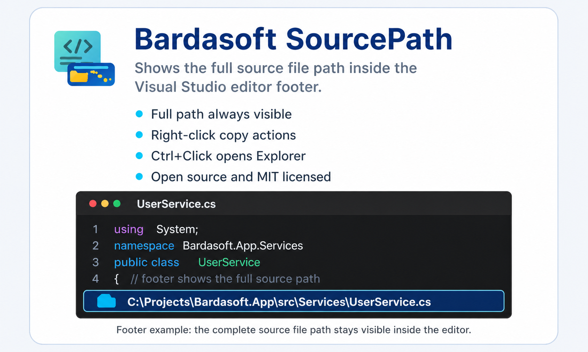
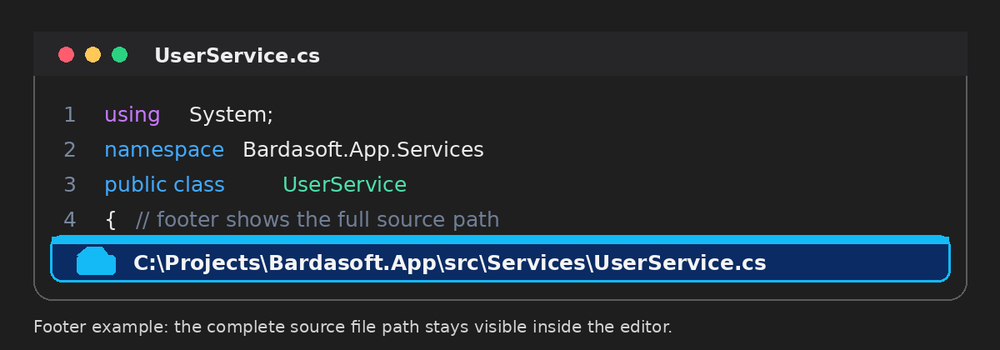

# SourcePath

  

    <strong>English</strong> 
    <strong>Free and open-source extension for Visual Studio.</strong> 
    Shows the full source file path of the active document in a discreet footer at the bottom of the editor.

    <strong>Español</strong> 
    <strong>Extensión gratuita y de código abierto para Visual Studio.</strong> 
    Muestra la ruta completa del archivo fuente activo en una barra inferior discreta dentro del editor.

---

## Description / Descripción

### English

**SourcePath** helps you quickly identify the exact file you are editing in Visual Studio.

It is especially useful when working with large solutions, multiple projects, deep folder structures, generated files, or repeated file names such as `User.cs`, `Program.cs`, `Settings.cs`, `App.xaml`, or `UserService.cs`.

The extension adds a clean and discreet footer at the bottom of the editor and displays the full path of the active file.

### Español

**SourcePath** ayuda a identificar rápidamente el archivo exacto que estás editando en Visual Studio.

Es especialmente útil cuando trabajas con soluciones grandes, múltiples proyectos, estructuras profundas de carpetas, archivos generados o nombres de archivo repetidos como `User.cs`, `Program.cs`, `Settings.cs`, `App.xaml` o `UserService.cs`.

La extensión agrega una barra inferior limpia y discreta dentro del editor, donde se muestra la ruta completa del archivo activo.

---

## Features / Características

### English

- Shows the full path of the active file inside the editor.
- Adds a clean and discreet visual footer.
- Helps distinguish files with equal or similar names.
- Allows copying the full file path.
- Allows copying only the file name.
- Allows copying the containing folder path.
- Allows opening the file location in Windows Explorer.
- Supports light and dark Visual Studio themes.
- Free and open source.

### Español

- Muestra la ruta completa del archivo activo dentro del editor.
- Agrega una barra visual limpia y discreta.
- Ayuda a diferenciar archivos con nombres iguales o similares.
- Permite copiar la ruta completa del archivo.
- Permite copiar únicamente el nombre del archivo.
- Permite copiar la ruta de la carpeta contenedora.
- Permite abrir la ubicación del archivo en el Explorador de Windows.
- Compatible con temas claros y oscuros de Visual Studio.
- Gratuita y de código abierto.

---

## Preview / Vista previa

  

---

## Usage example / Ejemplo de uso

  

---

## Donaciones / Donations

This project is free and open source.
If **SourcePath** is useful to you, you can support its development with an optional donation.

Este proyecto es gratuito y de código abierto.  
Si **SourcePath** te resulta útil, puedes apoyar su desarrollo con una donación voluntaria.

  

---

## Author / Autor

**Carlos Bardales Castañeda**  
Guatemala, Central America  
[BardaSoft@gmail.com](mailto:Bardasoft@gmail.com)

Developed by **Carlos Bardales Castañeda** as part of the **Bardasoft** project.

This extension was created to improve the Visual Studio development experience, especially when working with large .NET solutions, multiple projects, generated files, and repeated file names.

Esta extensión fue creada para mejorar la experiencia de trabajo en Visual Studio, especialmente al trabajar con soluciones grandes de .NET, múltiples proyectos, archivos generados y nombres de archivo repetidos.

## License / Licencia

This project is distributed under the **MIT License**.  
Este proyecto se distribuye bajo la licencia **MIT**.  

See the [LICENSE](LICENSE) file for more information.
